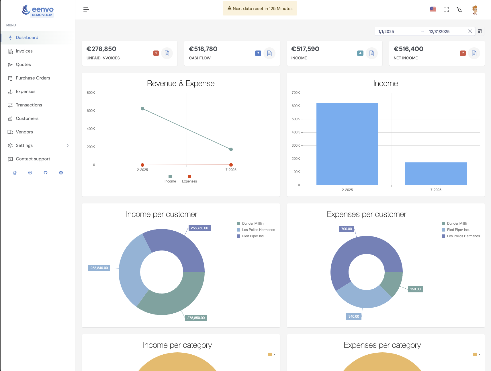
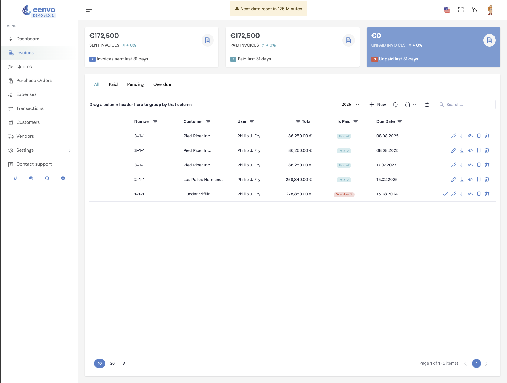
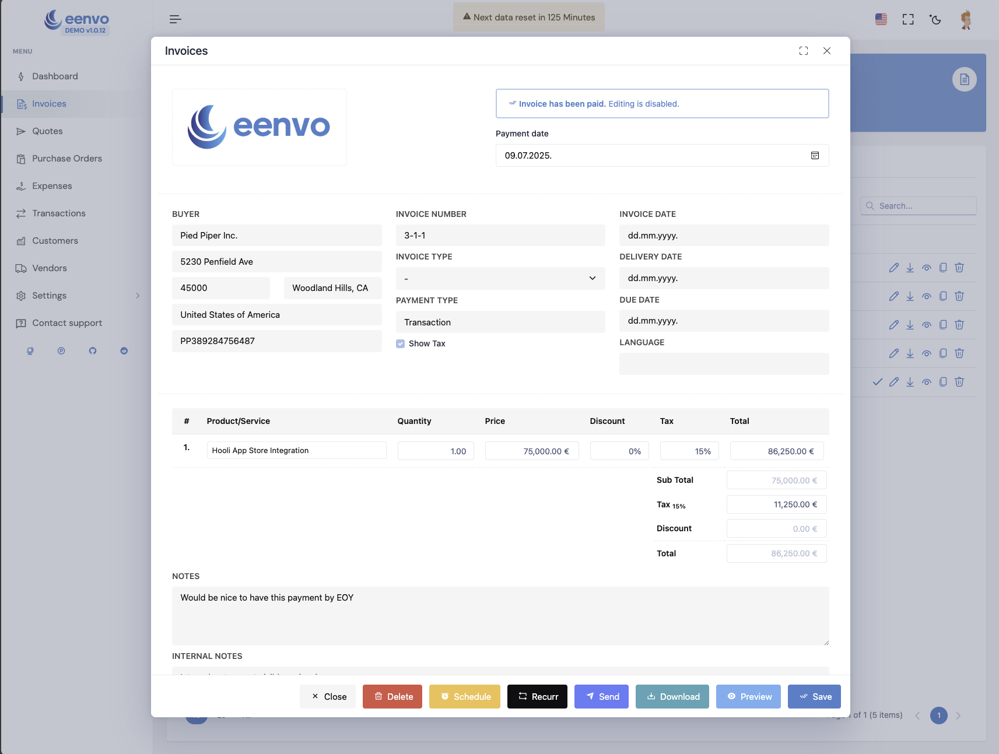
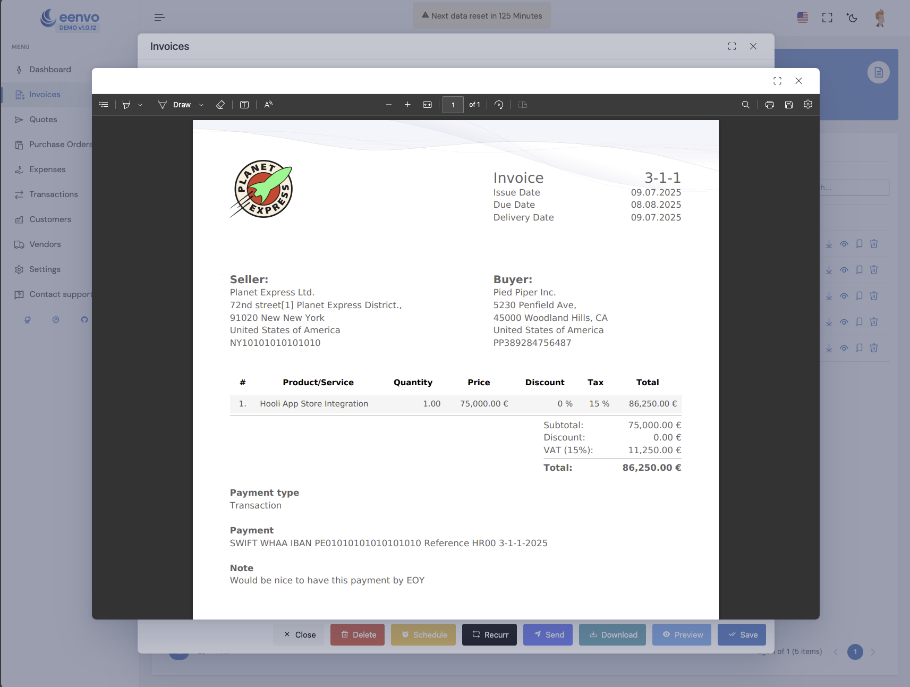

# Eenvo

**Live Demo:** [https://demo.eenvo.io](https://demo.eenvo.io)

**Production:** [https://app.eenvo.io](https://app.eenvo.io)

**Website:** [https://eenvo.io](https://eenvo.io)

Eenvo is a modern, self-hosted invoicing solution designed for businesses of all sizes. Built with Angular for the frontend and PocketBase for the backend, Eenvo offers a seamless experience for managing invoices, quotes, purchase orders, expenses, transactions, customers, vendors, and more. The platform features advanced statistics, powerful filtering, and multi-language support.

## Features

- **Dashboard**: Overview of your business performance.
- **Invoices**: Create, manage, and track invoices.
- **Quotes**: Generate and convert quotes to invoices.
- **Purchase Orders**: Manage supplier orders efficiently.
- **Expenses**: Track and categorize business expenses.
- **Transactions**: Monitor all financial transactions.
- **Customers & Vendors**: Manage your contacts and business relationships.
- **Settings**: Customize your experience.
- **Contact Support**: Built-in support contact option.
- **Powerful Statistics**: Visualize your business data with advanced analytics.
- **Advanced Filtering**: Quickly find what you need with robust filters.
- **Multi-language Support**: Available in English, Español, Deutsche, Italiana, Francias, Polish, and Hrvatski.

## Screenshots

- 
- 
- 
- 

## Requirements

- [Docker](https://www.docker.com/) & [Docker Compose](https://docs.docker.com/compose/)
- A valid [DevExtreme Key](https://js.devexpress.com/DevExtremeLicensing/)

## Quick Start (Docker Compose)

1. **Clone the repository:**

   ```sh
   git clone https://github.com/your-org/eenvo.git
   cd eenvo
   ```

2. **Set environment variables:**

   Create a `.env` file in the project root with the following content:

   ```env
   DEVEXTREME_KEY=your_devextreme_key_here
   POCKETBASE_ADMIN_EMAIL=admin@example.com
   POCKETBASE_ADMIN_PASS=your_secure_password
   ```

   - `DEVEXTREME_KEY`: Required for the web UI to function. Obtain from DevExtreme.
   - `POCKETBASE_ADMIN_EMAIL`: Email for the PocketBase admin user.
   - `POCKETBASE_ADMIN_PASS`: Password for the PocketBase admin user.

3. **Start the services:**

   ```sh
   docker compose up -d
   ```

   - The web UI will be available at [http://localhost](http://localhost)
   - The API (PocketBase) will be available at [http://localhost:8090](http://localhost:8090)

4. **Login:**
   - Use the admin email and password you set in the `.env` file to log in as the administrator.

## Docker Compose Variables

- `DEVEXTREME_KEY`: License key for DevExtreme (required for UI components).
- `API_URL`: URL for the backend API (default: `http://localhost:8090`).
- `POCKETBASE_ADMIN_EMAIL`: Email for the PocketBase admin user.
- `POCKETBASE_ADMIN_PASS`: Password for the PocketBase admin user.

## Advanced: Running with supervisord

If you prefer, you can run the backend and web server using `supervisord` for process management. The configuration is provided in `supervisord.conf`. This is useful for advanced deployments or when running inside custom containers.

To use supervisord:

1. Ensure `supervisord` is installed in your environment.
2. Edit `supervisord.conf` as needed.
3. Start supervisord:

   ```sh
   supervisord -c supervisord.conf
   ```

## Development

- Frontend: Angular
- Backend: PocketBase


## License

This project is licensed under the MIT License. See the [LICENSE](./LICENSE) file for details.

**Important:**
Eenvo uses third-party components such as DevExtreme by DevExpress, which are not open source and require a valid commercial license for production use. You are responsible for obtaining and complying with all third-party licenses.

Feel free to contribute or open issues for feature requests and bug reports.

---

*This project is not affiliated with DevExtreme or PocketBase. All trademarks are property of their respective owners.*